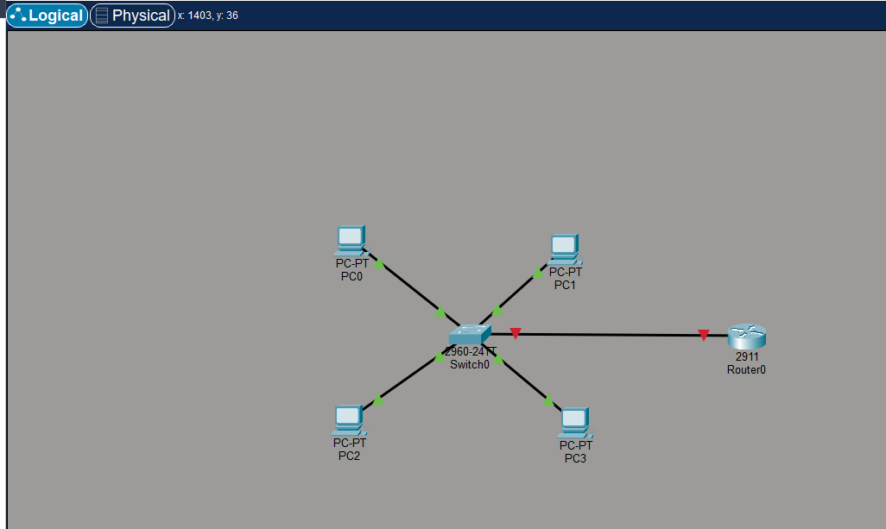
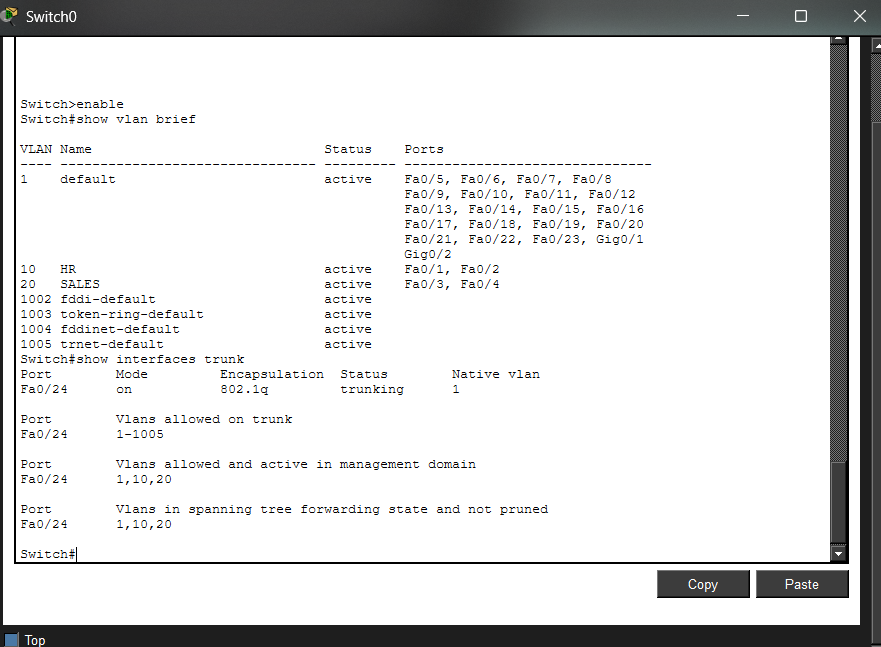
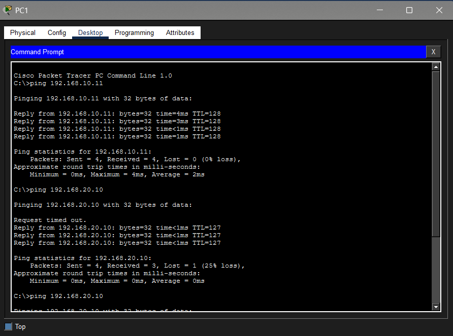

# VLAN Office Network Simulation

## Project Overview

This project demonstrates the implementation of a VLAN-based office network using Cisco Packet Tracer. The network is segmented into multiple VLANs to improve security and network management. Inter-VLAN communication is enabled using Router-on-a-Stick configuration.

The project also demonstrates basic network verification techniques used by network engineers, including VLAN verification, trunk configuration checks, and connectivity testing.

---

## Network Topology

The following diagram shows the logical topology of the simulated office network.



---

## VLAN Configuration Verification

VLANs were created on the switch and ports were assigned to their respective VLANs.
The trunk port connecting the switch and router was configured using IEEE 802.1Q encapsulation.

Verification commands used:

```
show vlan brief
show interfaces trunk
```

Screenshot of verification:



---

## Connectivity Verification

Connectivity between devices in the same VLAN and across different VLANs was tested using the `ping` command from the PC command prompt.

This confirms that inter-VLAN routing is functioning correctly.



---

## Network Devices Used

* Cisco 2960 Switch
* Cisco 2911 Router
* 4 End Devices (PCs)

---

## VLAN Structure

| VLAN ID | Department | Network          |
| ------- | ---------- | ---------------- |
| 10      | HR         | 192.168.10.0 /24 |
| 20      | SALES      | 192.168.20.0 /24 |

---

## Key Networking Concepts Demonstrated

* VLAN segmentation
* Access port configuration
* Trunk configuration (802.1Q)
* Router-on-a-Stick inter-VLAN routing
* Basic network troubleshooting
* Connectivity verification using ping

---

## Tools Used

Cisco Packet Tracer

---

## Repository Structure

```
VLAN-Office-Network-Simulation
│
├── office_network_project.pkt
├── screenshots
│   ├── topology.png
│   ├── vlan_trunk_verification.png
│   └── ping_connectivity_test.png
└── README.md
```

---

## Author

AKshay Kumar
